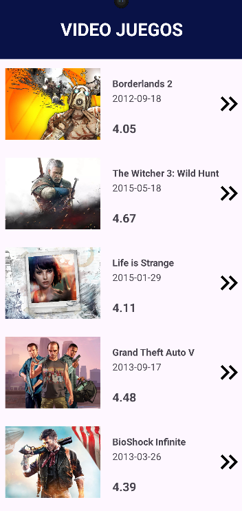
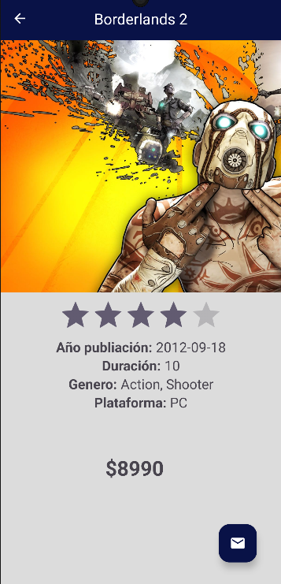

# ElixirGame

# Elixir Game

Elixir Game es una aplicación que simula una tienda de videojuegos. La aplicación está diseñada con el patrón de arquitectura MVVM y Clean Architecture, utilizando fragmentos para la navegación y gestión de vistas.

## Características

- **Conexión a una API**: La aplicación se conecta a una API para obtener la lista de videojuegos.
- **Arquitectura MVVM y Clean Architecture**: Implementación de patrones modernos de arquitectura para asegurar un código robusto y mantenible.
- **Navegación entre fragmentos**: Utiliza fragmentos para gestionar diferentes secciones de la aplicación y facilitar la navegación entre ellas.
- **RecyclerView**: Muestra la lista de videojuegos en un RecyclerView, proporcionando una interfaz fluida y eficiente para la visualización de grandes conjuntos de datos.
- **Detalle de Videojuegos**: Al hacer clic en un elemento de la lista, se muestra un fragmento de detalle con información detallada del videojuego seleccionado.
- **Enviar Correo**: Incluye un botón en el fragmento de detalle que permite enviar un correo electrónico a la empresa para cotizar o consultar sobre el producto.

## Capturas de Pantalla

## Tecnologías Utilizadas

- **Kotlin**: Lenguaje principal de la aplicación.
- **Retrofit**: Para las llamadas a la API.
- **Room**: Para el manejo de la base de datos local.
- **LiveData y ViewModel**: Para la gestión de datos y ciclos de vida.
- **Navigation Component**: Para la navegación entre fragmentos.
- **Material Design**: Para la interfaz de usuario.